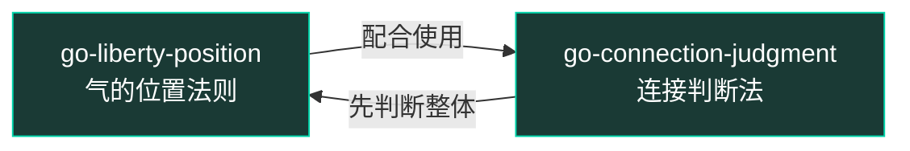

# 围棋方法论 Skills · 试点索引

> 来源：《围棋》第一册（邱百瑞）· 试点 2 页
> 蒸馏方法：cangjie-skill RIA-TV++

## Skill 一览

| # | Skill 名 | 一句话 | 类型 | 来源页 |
|---|---|---|---|---|
| 1 | `go-liberty-position` | 位置决定生存空间：中心 > 边缘 > 角落 | 原则 | 第 9-10 页 |
| 2 | `go-connection-judgment` | 真连接必须结构性共享资源，光近没用 | 框架 | 第 9-10 页 |

## 引用关系

**典型调用链**：
1. 先用 `go-connection-judgment` 判断两个单元是不是一个整体
2. 再用 `go-liberty-position` 整体估算气数（生存空间）

## 术语词典

| 术语 | 含义 |
|---|---|
| 气 | 棋子的生存空间，即紧邻的空交叉点 |
| 接/连 | 使分散的子连成一个整体的着法 |
| 断 | 把对方相连的子分割开的着法 |
| 中腹 | 棋盘中心区域 |
| 提子 | 气尽之后把对方棋子从棋盘上拿掉 |

## 后续规划

全 234 页预计可蒸馏 15-20 个 skill，涵盖：
- 基础规则：提子、活棋、地
- 战术：断、长、跳、飞
- 战略：布局、中盘、收官
- 思维方法：弃子、转换、厚薄、势与地
