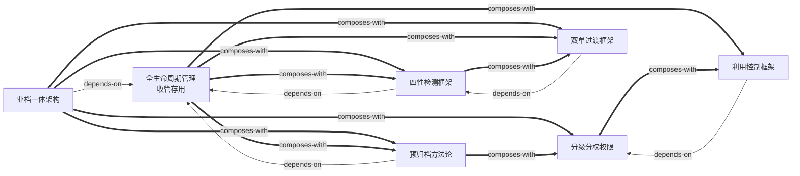

# 文书定-综合档案解决方案 — Skill Index

> 本方案由 cangjie-skill 蒸馏, 共产出 **7** 个 skills。
> 处理时间: 2026-08-31

## 关于本方案

- **来源**: 《文书定-综合档案解决方案》泛微文书定
- **版本**: 2025年3月
- **一句话主旨**: 通过"业档一体"架构实现电子档案从业务系统自动归档到全生命周期管理，解决传统档案管理中收集难、管理难、整理难、利用难的问题
- **整书理解**: 见 [BOOK_OVERVIEW.md](./BOOK_OVERVIEW.md)
- **精华长文** (不读全书看这篇): [DIGEST.md](./DIGEST.md)
- **术语词典**: [GLOSSARY.md](./GLOSSARY.md)

---

## Skill 列表 (按主题分组)

### 架构与流程层

- [`archives-yidang-yiti`](./archives-yidang-yiti/SKILL.md) — **业档一体架构框架**：业务系统与档案系统深度融合的整体架构，实现100%自动归档和双向赋能
- [`archives-lifecycle`](./archives-lifecycle/SKILL.md) — **全生命周期管理框架（收管存用）**：档案管理四阶段完整流程框架——收集、管理、保存、利用

### 专项方法层

- [`archives-pre-archiving`](./archives-pre-archiving/SKILL.md) — **预归档平台方法论**：收集整理前置化，从单兵作战到系统作战的三级协作体系
- [`archives-four-tests`](./archives-four-tests/SKILL.md) — **四性检测框架**：基于DA/T70的电子档案质量检测体系——真实性、完整性、安全性、可用性
- [`archives-permissions`](./archives-permissions/SKILL.md) — **分级分权权限管理框架**：全宗+门类为基本单元的六维权限控制体系
- [`archives-access-control`](./archives-access-control/SKILL.md) — **档案利用控制框架**：从检索到内容的四层精细化利用控制，平衡安全与利用

### 战略路径层

- [`archives-dual-to-single`](./archives-dual-to-single/SKILL.md) — **双套制向单套制过渡框架**：从纸质+电子双套制逐步过渡到纯电子单套制的三步路径

---

## 引用图



图例:
- `-->`  depends-on（依赖，使用前提）
- `===>` composes-with（组合，经常配合使用）

---

## 推荐学习顺序

(从依赖图的叶子节点开始, 向上)

### 第一层：基础框架
1. **全生命周期管理框架（收管存用）** — 最基础，所有其他skill的通用背景
2. **分级分权权限管理框架** — 权限体系是所有管理的基础支撑

### 第二层：专项方法
3. **预归档平台方法论** — 依赖全生命周期框架，是"收集"阶段的深化
4. **四性检测框架** — 依赖全生命周期框架，是质量控制的核心
5. **档案利用控制框架** — 依赖分级分权框架，是"利用"阶段的深化

### 第三层：架构与战略
6. **业档一体架构框架** — 依赖全生命周期框架，组合预归档、四性检测、分级分权
7. **双套制向单套制过渡框架** — 依赖四性检测框架，组合业档一体和全生命周期

---

## 安装使用

本目录是构建产物, 宿主不会从这里加载 skill。要让 agent 真正调用, 把 skill 目录复制到宿主的 skills 目录:

```bash
# 用户级 (所有项目可用)
cp -r archives-yidang-yiti ~/.claude/skills/
cp -r archives-lifecycle ~/.claude/skills/
cp -r archives-pre-archiving ~/.claude/skills/
cp -r archives-four-tests ~/.claude/skills/
cp -r archives-permissions ~/.claude/skills/
cp -r archives-access-control ~/.claude/skills/
cp -r archives-dual-to-single ~/.claude/skills/
```

---

## 接入 darwin-skill

所有 skill 均带有 `test-prompts.json` (darwin-skill 兼容格式), 可直接接入自动进化:

```
darwin evolve books/wenshuding-archives-solution/
```

---

## 审计轨迹

- 候选单元池: [candidates/](./candidates/)
- 被淘汰的候选 (含原因): [rejected/](./rejected/)
- BOOK_OVERVIEW: [BOOK_OVERVIEW.md](./BOOK_OVERVIEW.md)
- 验证通过列表: [verified.md](./verified.md)
